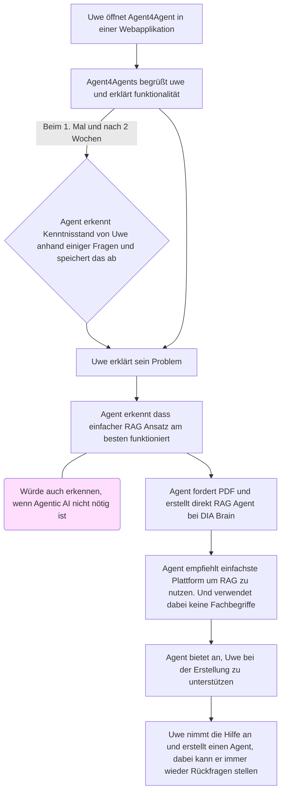
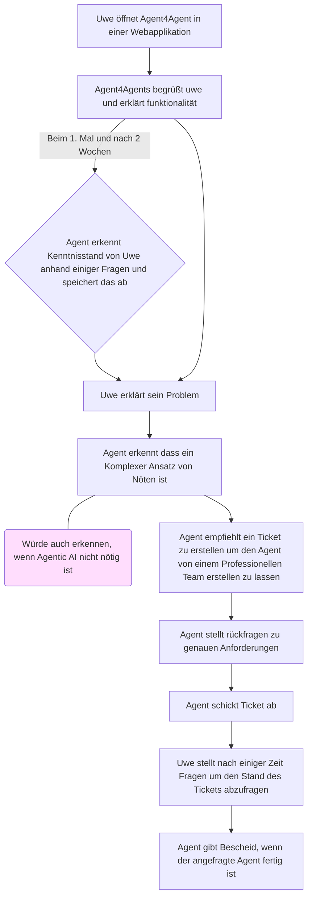
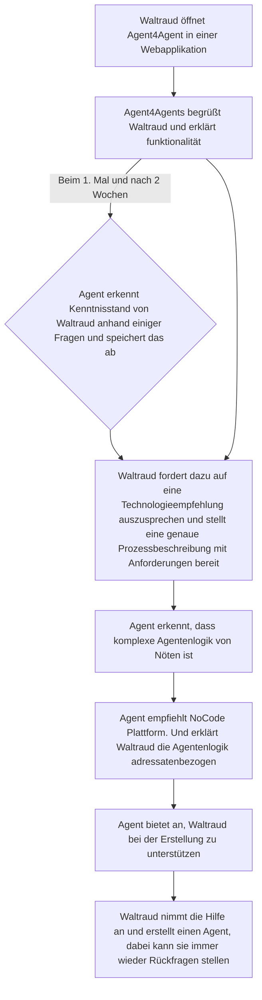
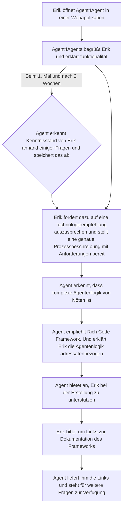

# User Personas und Use Cases

---

## User Persona 1: Uwe Unerfahren

### Persona-Beschreibung

- Langjähriger Buchhalter bei Bosch
- Kennt Prozesse in und auswendig
- Technikunaffin
- Kennt sich überhaupt nicht mit Agentic AI aus

### User Ziele

- Er hätte gerne einen Agenten, der den Prozess kennt und bei Fragen unterstützen kann
- Er hätte gerne einen Agenten, der Rechnungen liest, auf Fehler überprüft, eine Zusammenfassung der Positionen schreibt und in eine Excel Liste in Sharepoint einträgt

### Workflows

#### Workflow: Einfacher Anwendungsfall (RAG)

Dieser Workflow beschreibt, wie "Agent4Agent" Uwe bei einem einfachen Problem unterstützt, das mit einem RAG-Ansatz (Retrieval-Augmented Generation) gelöst werden kann.

#### Workflow: Komplexer Anwendungsfall (Ticket-Erstellung)

Dieser Workflow zeigt, wie "Agent4Agent" Uwe hilft, wenn ein komplexes Problem erkannt wird, das professionelle Unterstützung erfordert.

---

## User Persona 2: Waltraud Workflow

### Persona-Beschreibung

- Wirtschaftsinformatikerin bei Bosch
- Kennt Prozesse in und auswendig
- Kennt sich ein bisschen mit NoCode/LowCode Tools aus und ein wenig technisches Know How
- Weiß, wie Anforderungen richtig Dokumentiert werden

### User Ziele

- Hat einen repetitiven Prozess in der beschaffungs Abteilung entdeckt
- Braucht einen Agenten, der automatisiert nach Angeboten im Internet recherchiert und in einer Tabelle in Sharepoint dokumentiert

### Workflow

Dieser Workflow beschreibt, wie "Agent4Agent" Waltraud bei der Erstellung eines Agenten mit komplexer Logik über eine NoCode-Plattform unterstützt.

---

## User Persona 3: Erik Entwickler

### Persona-Beschreibung

- Erfahrener Entwickler bei Bosch
- Kennt Probleme seiner Abteilung gut
- Kann Programmieren und hat überblick über Technologien
- Kennt nicht alle Agentic Frameworks im Detail

### User Ziele

- Erik hat aus seiner Abteilung einen UseCase bekommen, der mehrere miteinander interagierende Agenten benötigt
- **Systemanforderung:**
  - Ein System muss selbstständig den globalen Markt nach einer kritischen Komponente durchsuchen
  - Es analysiert parallel Tausende potenzielle Lieferanten anhand von Preis, Lieferzeit und komplexen Risikofaktoren (z.B. geopolitische Stabilität, Finanz-Compliance)
  - Das System führt autonom parallele Verhandlungen (Ausschreibungen) durch, um den Vertrag mit dem Lieferanten abzuschließen, der das optimale Preis-Risiko-Verhältnis bietet

### Workflow

Dieser Workflow zeigt, wie "Agent4Agent" Erik bei der Auswahl und Implementierung eines komplexen Multi-Agenten-Systems mit einem "Rich Code Framework" unterstützt.

